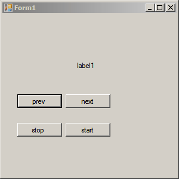

# SpeedTextViewer

Это очень древний проект, еще с тех времен, когда увлекался скорочтением. Идея была такая: выдавать читателю текст короткими отрывками через какой-то промежуток времени. Получилось что-то такое:

Выдает всего по слову, но хотелось — по короткому предложению, лишь бы попадало в область зрения. По-идеи, это значительно бы ускорило чтение, и возможно даже, расширило границы видимости глаз, чтобы в будущем можно было захватывать целые абзацы.

Как собрать проект — кто его помнит. Возможно, однажды вернусь к нему и перепишу на Web: так удобнее всего.